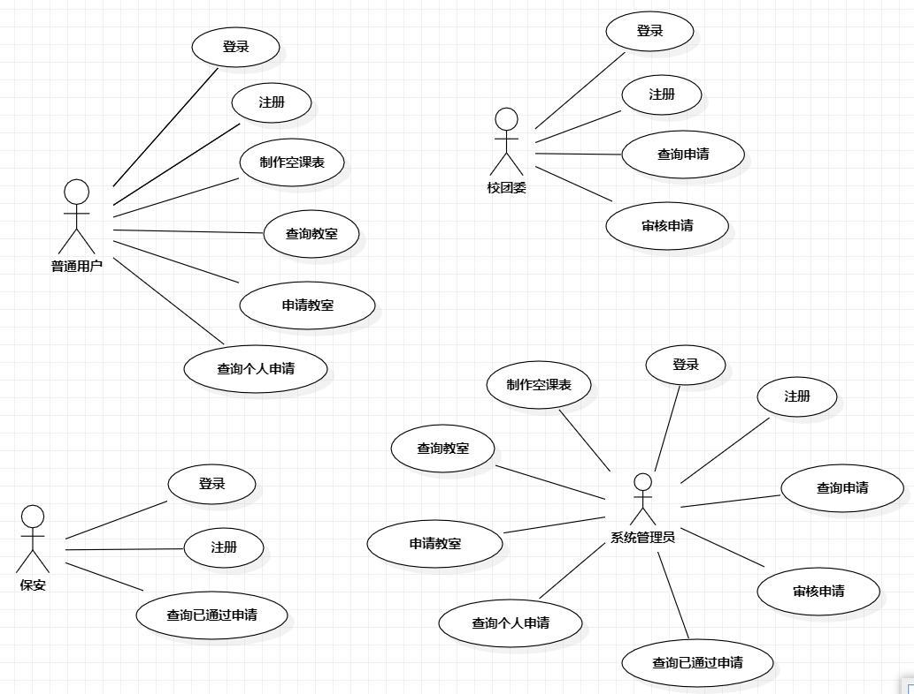

back-end（后端代码）
database（数据库）
front-end（前端代码）
image（项目展示图片）

项目使用展示+核心源码解说视频 链接（百度云盘）
链接：https://pan.baidu.com/s/1VcdOaRPvtfXfEb19VUOOPg 
提取码：lqm6

### 目录

一、需求分析与系统设计

​	1.1 需求分析

​	1.2 原型设计

​	1.3 系统设计

二、软件系统开发

​	2.1 数据库开发

​	2.2 服务端工程开发

​	2.3 前端工程开发

三、系统运行测试

​	3.1 运行

四、总结

# 摘要

本报告基于SSM+MVC三层架构，介绍了一个校园资源管理系统的设计和实现。该系统旨在提供制作空课表、查询教室、借教室、教室信息管理等功能。

在需求分析阶段，对系统功能需求进行了详细分析，并设计了系统原型。通过原型设计，定义了系统的界面布局和交互流程，以确保用户友好性和易用性。

系统采用了SSM+MVC三层架构，其中数据访问层（DAO）负责与数据库进行交互，业务逻辑层（Service）处理系统的业务逻辑，控制器层（Controller）接收和处理前端请求。这种架构的优势在于分离关注点，提高了代码的可维护性和可扩展性。

在系统实现方面，进行了数据库开发和服务端工程开发。数据库设计包括用户信息表、学生表、学生课程表、教室课程表和数据记录表等。服务端工程开发涉及数据访问层的Mapper接口和映射文件的创建，业务逻辑层的接口和实现类的编写，以及控制器层的设计和开发。

同时，前端工程开发使用vue.js+elementplus+VueX+vue-Router+axios等技术，实现了用户界面的设计和交互。通过axios等技术，实现了前后端数据的传递和页面的动态更新。

通过本报告，我们展示了基于SSM+MVC三层架构实现校园资源管理系统的设计和实现过程，以及系统的功能和特点。该系统在校园资源信息管理方面具有重要的实际意义，可提高校园资源信息的管理效率和准确性。

# 一、需求分析与系统设计

## 1.1 需求分析

#### 1）理解项目的功能

空课表管理：录入成员人数和姓名，生成空课表。

教室资源管理：查询教室信息状况，提交借教室表单，审批借教室表单，查询借教室表单，记录借教室信息。

#### 2）功能性需求

制作空课表：输入人数和姓名，通过该系统获取相关信息，然后自动生成一个空课表。

查询教室信息：输入筛选教室条件，展示符合筛选条件的教室编号。

提交借教室表单：编辑借教室表单信息，包括申请单位、学生班级、学生人数、教室数量、申请教室、申请日期、申请时间、申请人、联系电话、使用原因等字段，由普通用户提交表单，自动发送给校团委用户。

审核借教室表单：审核表单信息，通过或者不通过，通过由系统自动生成验证码。

查询借教室表单：展示借教室表单详情，包括审核状态和验证码。

#### 3）非功能性需求

系统应具备数据的完整性和一致性，防止数据丢失或损坏。

系统应能够处理并适当回复异常情况，如数据库连接失败或数据访问异常。

#### 4）核心系统用例

**提交借教室申请**

•  用例名称：提交借教室申请

•  用例编号：uc05

•  参与者：普通用户。

•  用例简述：该用例描述一个普通用户填写并提交一份借用教室的申请表的行为。

•  前置条件：普通用户成功登录校园资源管理系统。

•  触发器：普通用户选择“找教室_申请表单”功能启动用例。

•  后置条件：必填项填写完毕并提交时，系统向校团委提交申请必填项未填写完全，系统不会提交申请失败。

•  基本流：

1. 普通用户选择“申请表单”功能时，启动用例；

2. 系统显示表单申请填写输入界面；

3. 普通用户输入申请单位、学生班级、学生人数、需教室数量、申请教室、申请人、联系电话、使用原因，并选择提交；

4. 系统确认普通用户输入信息有效，申请提交至校团委处，用例结束。

•  拓展事件流：

​	3a. 如果普通用户未完全填写必填项，系统提示：“必填项未完全填写，请完全填写必填项”，返回

2。

**制作空课表**

•  用例名称：制作空课表

•  用例编号：uc04

•  参与者：普通用户。

•  用例简述：该用例描述一个普通用户制作一份空课表的行为。

•  前置条件：普通用户成功登录校园资源管理系统。

•  触发器：普通用户选择“制作空课表”功能启动用例。

•  后置条件：生成成功时，系统生成空课表表格。生成失败时，系统不生成空课表表格。

•  基本流：

​		1.普通用户选择“制作空课表功能”，启动用例；

​       2.系统显示制作空课表输入界面；

​       3.普通用户输入人数和成员姓名，并选择“生成”  功能；

​       4.系统确认普通用户输入信息有效，显示空课表输  出界面，用例结束。

•  扩展事件流：

3a.如果普通用户输入人数与姓名个数不等，系统提示“人数与姓名不符，请重新输入。”返回2。

3b.如果普通用户输入姓名与数据库信息不符，系统提示“输入姓名有误，请重新输入。”返回2。

•  特殊需求：输入人数=输入姓名个数；输入姓名符合数据库信息。

**用例图**

## 1.2 原型设计

#### 1) 制作空课表用例

原型设计：设计一个包含用户输入字段的表单页面，需要人数和姓名。用户可以在表单中输入人数和姓名，并点击“生成空课表”按钮完成生成操作。

交互流程：用户打开功能页面，点击“制作空课表”→“输入”按钮，进入制作空课表输入页面。输入或选择人数，填写姓名后，点击“生成空课表”按钮，系统进行信息验证并生成空课表，返回空课表生成页面。

#### 2）提交借教室申请表单用例

原型设计：设计一个包含用户输入字段的表单页面，如申请单位、学生班级、学生人数、教室数量、申请教室、申请日期、申请时间、申请人、联系电话、使用原因等。用户可以在表单中输入申请信息，并点击“提交”按钮完成提交操作。

交互流程：用户打开功能页面，点击“找教室”→“申请表单”按钮，进入申请借教室页面。填写表单信息后，点击“提交申请”按钮提交表单，系统进行信息验证、保存表单信息并将表单发送给校团委用户，返回申请表单页面。

## 1.3 系统设计

#### 1） 数据库相关设计

​	**用户账号表（users）**

| **字段**  | **描述** | **类型** | **长度** | **约束**       |
| --------- | -------- | -------- | -------- | -------------- |
| Id        | 用户编号 | Int      |          | 主键，必须输入 |
| User_name | 用户名称 | Varchar  | 255      | 必须输入       |
| Pwd       | 密码     | Varchar  | 255      | 必须输入       |
| Stu_id    | 学号     | Varchar  | 255      | 必须输入       |
| Type      | 账号类型 | Int      |          | 必须输入       |
| Phone     | 手机     | Varchar  | 255      | 必须输入       |
| Stu_mail  | 邮箱     | Varchar  | 255      | 必须输入       |

​	**学生表**（students）

| **字段**   | **描述**   | **类型** | **长度** | **约束**       |
| ---------- | ---------- | -------- | -------- | -------------- |
| Student_id | 学生表编号 | Int      |          | 主键，必须输入 |
| Stu_id     | 学号       | Varchar  | 255      | 必须输入       |
| Stu_name   | 学生姓名   | Varchar  | 255      | 必须输入       |
| Stu_unit   | 专业       | Varchar  | 255      | 必须输入       |
| Stu_class  | 班级       | Varchar  | 255      | 必须输入       |

​	**班级课程表**（*n）

| **字段**  | **描述** | **类型** | **长度** | **约束**       |
| --------- | -------- | -------- | -------- | -------------- |
| Id        | 节数编号 | Int      |          | 主键，必须输入 |
| Stu_unit  | 专业     | Varchar  | 255      | 必须输入       |
| Stu_class | 班级     | Varchar  | 255      | 必须输入       |
| Moday     | 周一     | Varchar  | 255      |                |
| Tuseday   | 周二     | Varchar  | 255      |                |
| Wednesday | 周三     | Varchar  | 255      |                |
| Thusday   | 周四     | Varchar  | 255      |                |
| Friday    | 周五     | Varchar  | 255      |                |

​	**教室课程表**（*5，周一到周五）

| **字段**   | **描述**     | **类型** | **长度** | **约束**       |
| ---------- | ------------ | -------- | -------- | -------------- |
| Id         | 编号         | Int      |          | 主键，必须输入 |
| Position   | 教室位置     | Varchar  | 255      | 必须输入       |
| Moday      | 周一         | Varchar  | 255      |                |
| Tuseday    | 周二         | Varchar  | 255      |                |
| Wednesday  | 周三         | Varchar  | 255      |                |
| Thusday    | 周四         | Varchar  | 255      |                |
| Friday     | 周五         | Varchar  | 255      |                |
| People_max | 最大容纳人数 | Int      |          | 必须输入       |
| Type       | 配置类型     | Int      |          | 必须输入       |

​	**记录表**（encords）

| **字段**   | **描述**   | **类型** | **长度** | **约束**       |
| ---------- | ---------- | -------- | -------- | -------------- |
| Id         | 记录表编号 | Int      |          | 主键，必须输入 |
| Stu_id     | 学号       | Varchar  | 255      | 必须输入       |
| Unit       | 专业       | Varchar  | 255      | 必须输入       |
| Day        | 日期       | Date     |          | 必须输入       |
| Time       | 时间       | Varchar  | 255      | 必须输入       |
| Stu_class  | 申请人班级 | Varchar  | 255      | 必须输入       |
| People_num | 人数       | Int      |          | 必须输入       |
| Class_num  | 教室数量   | Int      |          | 必须输入       |
| Class      | 教室编号   | Varchar  | 255      | 必须输入       |
| User       | 申请人     | Varchar  | 255      | 必须输入       |
| Phone      | 手机       | Varchar  | 255      |                |
| Reason     | 原因       | Varchar  | 255      |                |
| Status     | 状态码     | Int      |          |                |

#### 2）UML建模设计

**类图设计**：

**时序图设计**：

# 二、软件系统开发

## 2.1 数据库开发

本CRMS项目主要是通过Navicat（Mysql专业版）通过图形化界面创建数据库以及数据表等结构设计，最终数据库创建完成的界面展示为：

## 2.2 服务端工程开发

​	项目后端集成MyBatisPlus：

​	设置数据库链接：

​	搭建数据层：（例：Users）

​	搭建Dao层：

​	UsersMapper：

​	UsersMapper.xml

​	搭建业务逻辑层：

​	UsersService：

​	UsersServiceImpl：

​	搭建控制层：

​	UsersController：

​	设置跨域：（CrossOrigins）

## 2.3 前端工程开发

​	前端依赖环境 vue  ui：

​	前端main,js

​	Axios配置在vue config.js

​	Router:

# 三、系统运行测试

## 3.1 运行

使用springboot内置的tomcat作为web服务器运行：

# 四、总结

在本次开发中，我们采用了SSM+MVC三层架构来实现员工系统。这种架构将系统分为表现层（Presentation Layer）、业务逻辑层（Business Logic Layer）和数据访问层（Data Access Layer）三个层次，使系统的各个模块职责清晰、结构清晰，并具备良好的可扩展性和可维护性。

通过需求分析，我们明确了校园资源管理系统的功能和需求。在原型设计阶段，我们创建了系统的页面原型，以确保用户界面的友好性和交互流畅性。在系统设计阶段，我们使用UML建模设计，包括类图、状态图和时序图等，帮助我们更好地理解系统中的实体、状态和流程，为开发人员提供了清晰的视图。

在服务端工程开发过程中，我们选择了Maven+Spring Boot框架，利用Maven进行项目构建和依赖管理，使用Spring Boot快速搭建服务端工程。我们集成了MyBatisPlus框架，实现了基于ORM思想的数据层封装技术，通过配置数据库连接和创建数据层、业务层、控制层组件，实现了系统的各项功能。同时，我们还设置了跨域访问，确保前后端之间的数据交互的安全性和可靠性。

总的来说，基于SSM+MVC三层架构的校园资源管理系统开发，通过清晰的层次划分和模块化设计，实现了系统功能的高效实现和开发的可维护性。该架构使得系统的各个模块之间的协作更加紧密，提高了团队的工作效率和代码质量。在未来的开发过程中，我们可以进一步扩展和优化系统的功能，以满足不断变化的需求和用户体验的提升。

系统的各项功能。同时，我们还设置了跨域访问，确保前后端之间的数据交互的安全性和可靠性。

总的来说，基于SSM+MVC三层架构的校园资源管理系统开发，通过清晰的层次划分和模块化设计，实现了系统功能的高效实现和开发的可维护性。该架构使得系统的各个模块之间的协作更加紧密，提高了团队的工作效率和代码质量。在未来的开发过程中，我们可以进一步扩展和优化系统的功能，以满足不断变化的需求和用户体验的提升。
